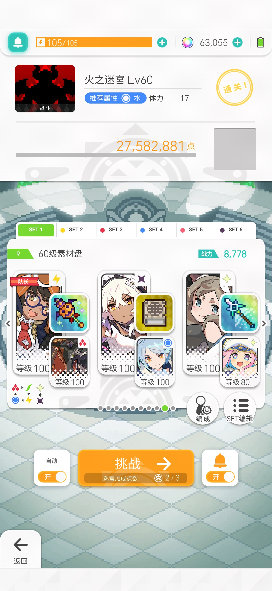

# 基于autojs的自用的接铃铛+刷副本（低技术力，第一次发，大佬轻喷）

## 没玩过git，先叠个甲 本资源仅供学习交流,严禁用于商业用途,请于24小时内删除。

## 一、模拟器环境：
  * 推荐夜神/逍遥，这俩我都用过确实蛮顺畅 
  * 分辨率：9:16（推荐540*960） 
  * DPI我这里自动180 渲染模式：DirectX（如果出现识别错误，换成OpenGL试试） 
  * 其他随意，大多没啥影响

## 二、运行环境： 
  * 下载AutoJS Pro（需要付费） / Autojs / AutoX（git上有，大佬基于autojs改的，没试过，大概率能用） 
  * 将文件导入，给予无障碍权限

## 三、文件使用
 ### 铃铛
  * 每个boss手动先打一遍，记录一下队伍（有队伍记录的可以跳过这步）
  * 在autojs中直接点击运行即可（可能出现无法自动开游戏，需要手动点击）
  * 脚本会自动登录游戏，会出现开着脚本的情况下和手机抢登录的情况。
 ### 副本
  * 老样子先过一遍，记录一下队伍
  * 在代码的17-19行里，修改需要嗑的药（"0"表示不嗑，"1"表示不嗑），嗑药会嗑到完全没药才停下
  * 这脚本与铃铛脚本不同，不会自动开游戏，各位玩家需要先自行点击到下面这个界面，再点击运行
  * 记得修改17-19行哦，默认会把小药嗑完
  
  

# 
注意！！！（新安装模拟器的必读） 

  本脚本没有改变出场队伍的功能，且由于副本对应的队伍记录是在本地的，请新安装模拟器，先进游戏，将每个副本boss到共斗(必须是共斗，别进单人打，单人和共斗的队伍记录是不一样的)里选好队伍打一遍，然后再用脚本挂着。
  

## 还请各位注意好各个boss的对应队伍，不要出现跨属铃铛的情况，尽量使用稳定的铃铛队伍，共同维护游戏环境

### 题外话： 

如果可以的话，穷学生想讨口饭吃（脱产考研没有经济来源）

在这里先谢谢各位,祝各位游戏愉快，十连必中彩

